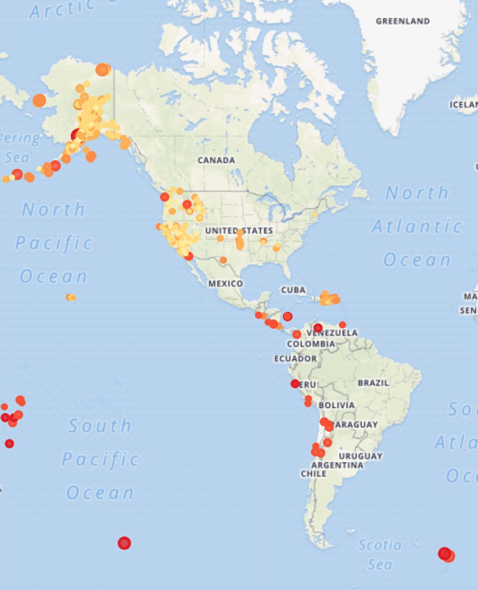

# Visualizing Data with Leaflet

## Background

 Visualize an earthquake data set from USGS. The data set is constantly being updated to include new events. Size and color of the dots vary base on severity of the earthquake.

